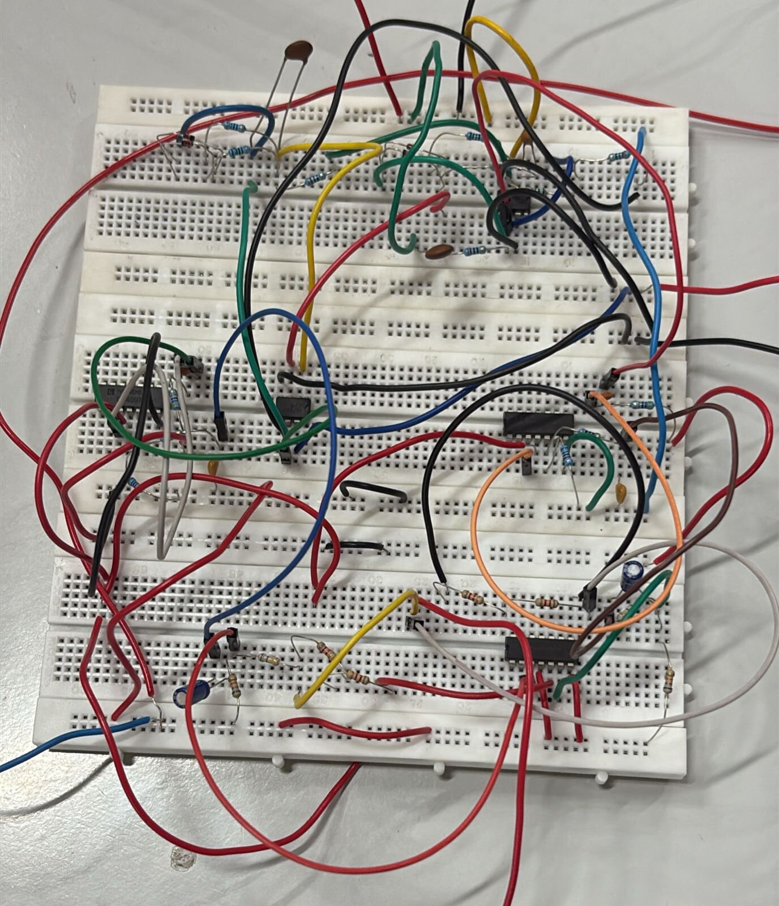
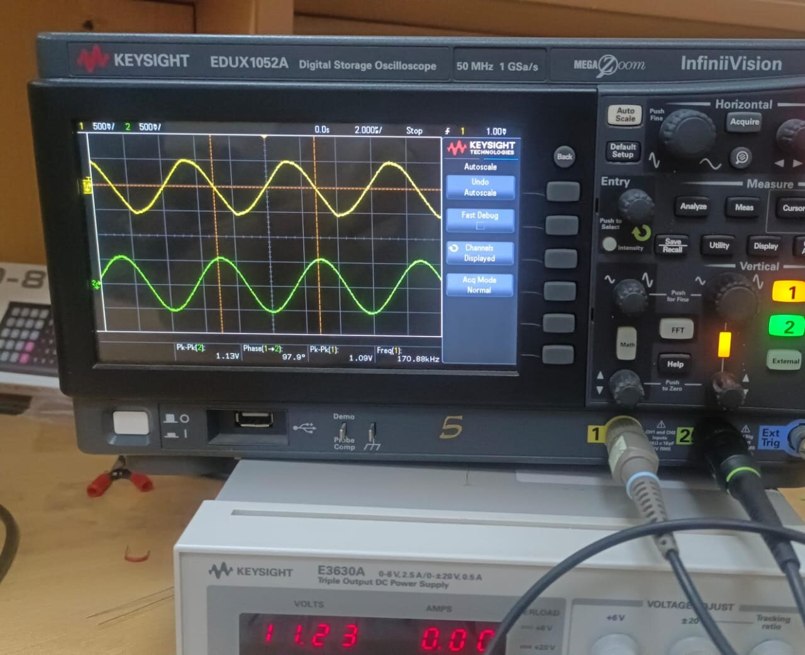
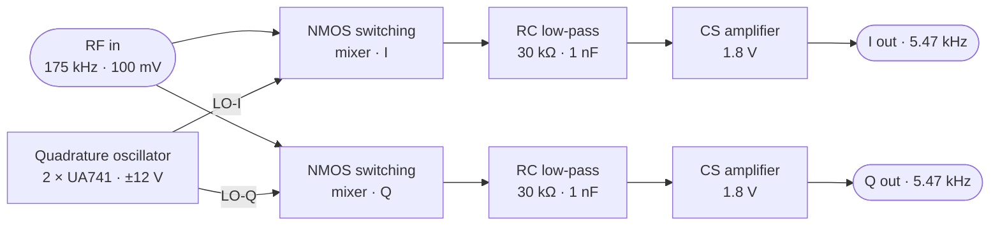
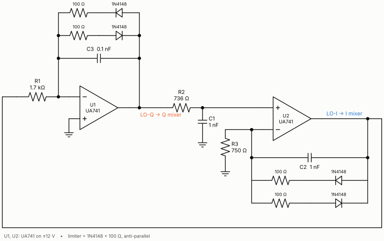
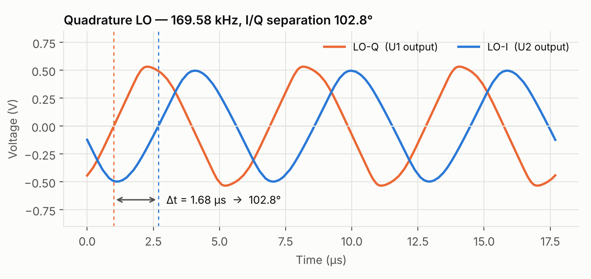
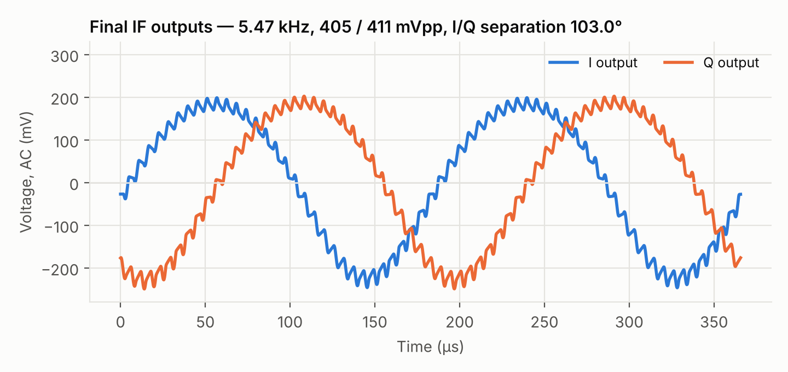
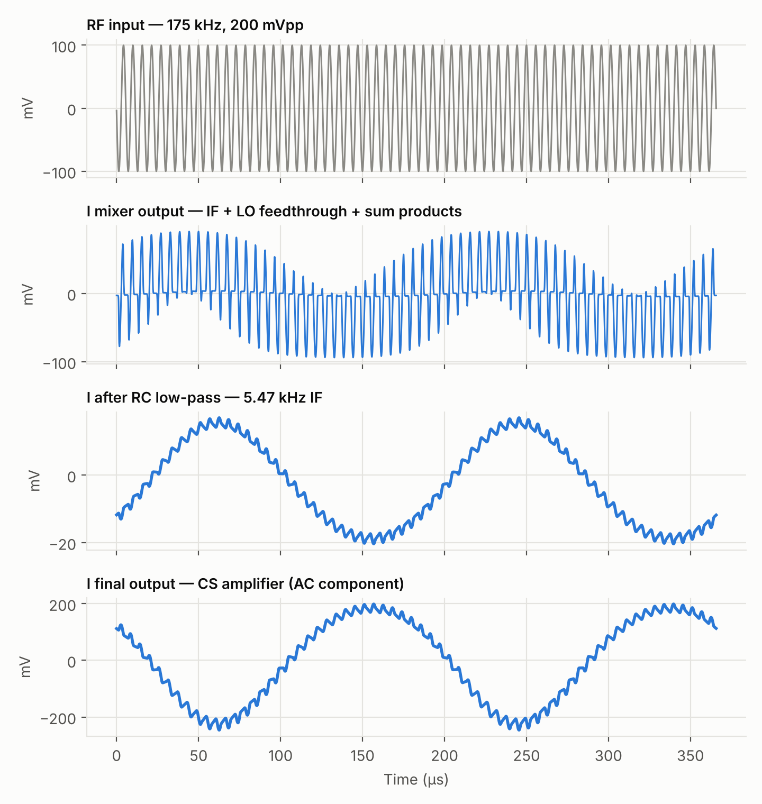
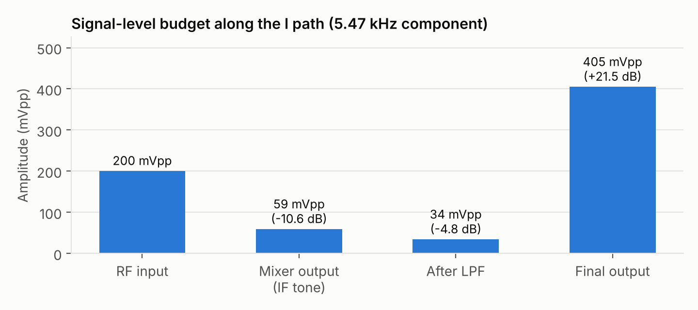

<h1 align="center">Quadrature Down Converter</h1>
<p align="center"><b>An I/Q receiver front-end designed from first principles, verified in LTspice with foundry device models, and built and measured on the bench.</b></p>

<p align="center">
  
  
  
  
  
  
</p>

## Skills demonstrated

| Area | What this project exercises |
|---|---|
| **Analog circuit design** | Op-amp quadrature oscillator with nonlinear amplitude control · NMOS passive switching mixer · RC filtering and loading · common-source amplifier biasing in moderate inversion · AC coupling |
| **RF & communication systems** | I/Q (quadrature) down-conversion · heterodyne vs. zero-IF/low-IF receivers · image frequency and image-rejection ratio · I/Q gain/phase imbalance · mixing products, LO feedthrough, even-order distortion |
| **Circuit simulation** | LTspice transient / AC / FFT / operating-point analyses · BSIM3v3 (TSMC 180 nm) MOSFET models with full W, L, AD, AS, PD, PS · Boyle op-amp macromodel · convergence (Gmin / source stepping) and timestep control |
| **Measurement & DSP** | Coherent-DFT tone extraction · harmonic distortion (dBc, THD) · phase measurement by FFT and zero-crossing timing · windowed spectra · signal-level budgeting |
| **Software** | Python tooling to parse LTspice binary `.raw` files, extract netlists from `.asc` schematics, measure results and render every figure and schematic in this repo |
| **Hardware bring-up** | Breadboard prototyping with UA741, 1N4148 and discrete NMOS · Keysight EDUX1052A oscilloscope (time-domain and FFT) · function generators · dual-rail supplies · simulation-vs-measurement root-causing |
| **Technical writing** | IEEE two-column report in LaTeX · reproducible documentation |

---

<p align="center">
  
  &nbsp;
  
</p>
<p align="center"><sub>The complete receiver on breadboard, and its quadrature local oscillator on a Keysight EDUX1052A.</sub></p>

## Overview

Every modern radio (Wi-Fi, Bluetooth, LTE, GPS) has to shift a high-frequency carrier down to a frequency where it can be filtered and digitised. A **quadrature down converter** does this by multiplying the incoming signal with two copies of a local oscillator (LO) that are 90° apart. This produces an in-phase (I) and a quadrature (Q) output, which together keep the *sign* of the frequency offset — the property that lets a receiver reject its image channel without a bulky RF filter.

This project implements the full chain at bench-friendly frequencies:

| | |
|---|---|
| RF input | 175 kHz, 100 mV amplitude |
| Local oscillator | ~170 kHz, two outputs in quadrature, ~1 V<sub>pp</sub> |
| IF output | ~5 kHz, I and Q, ~400 mV<sub>pp</sub> each |
| Rules | Op-amps only for the oscillator — all signal-path gain from discrete MOSFETs |

## Architecture



| Quadrature oscillator | One signal path (mixer → filter → amplifier) |
|---|---|
|  |  |

Schematics are rendered from the netlists of the LTspice designs in [`simulation/`](simulation).

## Results

All simulated values below are **measured from the LTspice waveform data** by [`scripts/analyze.py`](scripts/analyze.py), not read off cursors. Hardware values were measured on the oscilloscope.

| Parameter | Simulation | Hardware |
|---|---|---|
| LO frequency | 169.6 kHz | 168.5 kHz |
| LO amplitude, I / Q | 1.00 / 1.07 V<sub>pp</sub> | 0.98 / 0.95 V<sub>pp</sub> |
| LO I/Q separation | 102.8° | — |
| RF input | 175 kHz | 173.5 kHz (retuned to hold the IF) |
| IF frequency | 5.47 kHz | 5.0 kHz |
| Mixer conversion gain | −10.6 dB | −13 dB |
| Final output, I / Q | 405 / 411 mV<sub>pp</sub> | 385 / 378 mV<sub>pp</sub> |
| **Final I/Q separation** | **103.0°** | **86°** |
| Image-rejection ratio implied by I/Q imbalance | 18.8 dB | 28.8 dB |
| Supplies | ±12 V (op-amps), 1.8 V (MOSFET stages) | same |

| LO in quadrature | Final I and Q outputs |
|---|---|
|  |  |

<p align="center"></p>
<p align="center"><sub>The I path stage by stage: the NMOS chops the RF input at the LO rate, the RC filter recovers the 5.47 kHz difference tone, and the CS stage amplifies it by 21.5 dB.</sub></p>

## Engineering findings

These are the things the data taught us, beyond "it works".

**1. The 741, not the RC network, sets the oscillation frequency.**
In the textbook three-RC quadrature oscillator (TI, Mancini) all three time constants are equal and $f_0 = 1/2\pi RC$. Here the integrator uses 1.7 kΩ / 0.1 nF (0.17 µs) against 0.74 µs in the other two sections, which would oscillate at **≈ 448 kHz** with ideal op-amps. At 170 kHz the UA741 has an open-loop gain of only ≈ 5.9 (GBW ≈ 1.1 MHz from its macromodel), and the ~7× excess loop gain designed in compensates for that. The circuit settles where the *op-amps' phase lag* closes the loop, at 169.6 kHz. The 741's full-power bandwidth at 1 V<sub>pp</sub> is only ≈ 162 kHz (slew rate 0.51 V/µs), so the oscillator is operating right at the device's limit — a point Hölzel [5] makes about op-amp quadrature oscillators in general.

**2. Finite op-amp gain breaks the 90° — and the I/Q phase inherits it exactly.**
The non-inverting integrator (U2) only gives −90° if its inputs track. At 170 kHz they differ by **14° and 26 % in amplitude**, so the stage delivers −102.8° and the LO pair is 102.8° apart. Mixing translates the LO phase relationship directly onto the IF: the final outputs are **103.0°** apart, matching to 0.3°. Quadrature accuracy is a matching and bandwidth problem, not an absolute-value problem.

**3. Even-order distortion dominates, not odd.**
The mixer is driven by a sinusoidal LO, so the NMOS turns on softly, and its source is driven by the RF signal, so R<sub>ON</sub> is modulated by the input (plus body effect). The result is a **2·IF product at −22 dBc** at the mixer and −20 dBc at the output (the CS stage's square-law adds to it); the third harmonic is only −40 dBc. A balanced (differential) mixer would cancel the even-order terms.

**4. Loading matters as much as the filter corner.**
The 30 kΩ / 1 nF filter has a 5.3 kHz corner on paper, but the 10 kΩ mixer load and the switch's time-varying source resistance make the IF see **−4.8 dB**, not the −2.8 dB a lone RC predicts. The level budget below accounts for every dB from input to output.

| Mixer output spectrum | Signal-level budget |
|---|---|
|  |  |

Full design derivations are in [`docs/`](docs).

## Concepts covered

| Topic | Where it appears |
|---|---|
| Barkhausen criterion, loop gain and phase | Oscillator start-up and frequency — [docs/02](docs/02-quadrature-oscillator.md) |
| Integrators, all-pass/phase-shift networks, quadrature generation | Three-RC oscillator vs. Hölzel's all-pass oscillator — [docs/02](docs/02-quadrature-oscillator.md) |
| Op-amp GBW, slew rate, full-power bandwidth, macromodels | Why a 741 at 170 kHz behaves as it does — [docs/02](docs/02-quadrature-oscillator.md) |
| Nonlinear amplitude stabilisation (diode limiting / AGC) | 1N4148 + 100 Ω limiters across the integrator capacitors |
| Switching-mixer theory, Fourier series of the switching function | Conversion gain $1/\pi$ (−9.9 dB) — [docs/03](docs/03-nmos-switching-mixer.md) |
| MOSFET triode R<sub>ON</sub>, body effect, BSIM3 parameters (V<sub>TH0</sub>, T<sub>OX</sub>, junction capacitance from AD/AS/PD/PS) | Mixer device sizing and parasitics — [docs/03](docs/03-nmos-switching-mixer.md) |
| LO feedthrough, self-mixing DC offset, even-order intermodulation | Mixer spectrum and AC coupling |
| First-order RC filters, source/load interaction, Bode response | IF filter — [docs/04](docs/04-filter-and-amplifier.md) |
| Common-source gain, divider biasing, moderate/weak inversion, g<sub>m</sub>/I<sub>D</sub>, AC-coupling corners | Output amplifier — [docs/04](docs/04-filter-and-amplifier.md) |
| Image frequency, complex baseband, image-rejection ratio vs. gain/phase error | [docs/01](docs/01-theory.md) and results |
| Heterodyne, direct-conversion (zero-IF) and low-IF receiver architectures | [docs/01](docs/01-theory.md) |
| SPICE convergence, timestep control, FFT windowing and coherent sampling | [docs/06](docs/06-simulation-methodology.md) |

## Repository layout

```
quadrature-down-converter/
├── README.md
├── docs/
│   ├── 01-theory.md                       I/Q down-conversion, image rejection, architectures
│   ├── 02-quadrature-oscillator.md        topology, loop analysis, 741 limits, amplitude control
│   ├── 03-nmos-switching-mixer.md         switching theory, sizing, distortion, frequency sweep
│   ├── 04-filter-and-amplifier.md         RC filter + loading, CS amplifier bias and gain
│   ├── 05-system-results.md               full-system simulation vs. hardware
│   └── 06-simulation-methodology.md       how every number was extracted
├── simulation/                            LTspice schematics (see simulation/README.md)
│   ├── oscillator.asc
│   ├── qdc_full_system.asc
│   └── UA741.asy
├── scripts/
│   ├── ltspice_raw.py                     LTspice binary .raw reader
│   ├── analyze.py                         measurements + all plots in media/plots
│   ├── asc_netlist.py                     netlist extraction from .asc schematics
│   └── draw_schematics.py                 schematics in media/schematics
├── hardware/README.md                     bill of materials, bench setup, bring-up notes
├── media/                                 plots, schematics, oscilloscope captures, LTspice screenshots
└── report/                                IEEE-format project report (PDF) + errata
```

## Reproducing the results

1. Install [LTspice](https://www.analog.com/en/resources/design-tools-and-calculators/ltspice-simulator.html) and place the two model files next to the schematics (instructions in [`simulation/README.md`](simulation/README.md)).
2. Run `simulation/oscillator.asc` and `simulation/qdc_full_system.asc`.
3. Regenerate the measurements and figures:

```bash
pip install -r requirements.txt
python scripts/analyze.py --osc simulation/oscillator.raw --system simulation/qdc_full_system.raw --out media/plots
python scripts/draw_schematics.py
```

`analyze.py` prints every number in the results table and writes them to `media/plots/measurements.json`.

## Limitations and next steps

- **Faster op-amp.** A higher-GBW, higher-slew part (e.g. LM318, ~15 MHz) would put the oscillator back under RC control and pull the quadrature error toward 0°.
- **Quadrature correction.** Trim the U2 time constant, or add a phase-locked correction loop, to null the 13° error.
- **Balanced mixers.** A differential (double-balanced) switching mixer cancels LO feedthrough and the dominant 2·IF product.
- **Sharper filtering.** A second-order (or active, buffered) low-pass gives −40 dB/decade and removes the residual LO ripple visible on the outputs.
- **Close the loop on image rejection.** Phase-shift one branch by 90° and sum (Hartley architecture), then sweep the RF input across the LO to measure image rejection directly.

## Team

| Name | Contribution |
|---|---|
| **Shreyansh Rawat** | <!-- add contribution --> |
| **Shreyaas Sarkaar** | <!-- add contribution --> |
| **Hiten Arora** | <!-- add contribution --> |

Built for *Analog Electronic Circuits (EC2.103)*, IIIT Hyderabad, Spring 2026.

## References

1. A. A. Abidi, "Direct-conversion radio transceivers for digital communications," *IEEE J. Solid-State Circuits*, vol. 30, no. 12, pp. 1399–1410, Dec. 1995.
2. B. Razavi, *RF Microelectronics*, 2nd ed., Prentice Hall, 2011, ch. 3–4.
3. A. S. Sedra and K. C. Smith, *Microelectronic Circuits*, 7th ed., Oxford University Press, 2015.
4. R. Mancini, "Design of op amp sine wave oscillators," *TI Analog Applications Journal*, Aug. 2000. [ti.com/lit/an/slyt164/slyt164.pdf](https://www.ti.com/lit/an/slyt164/slyt164.pdf)
5. R. Hölzel, "A simple wide-band sine wave quadrature oscillator," *IEEE Trans. Instrum. Meas.*, vol. 42, no. 3, pp. 758–760, 1993. [doi:10.1109/19.231604](https://doi.org/10.1109/19.231604)

## License

Code and documentation are released under the [MIT License](LICENSE).
