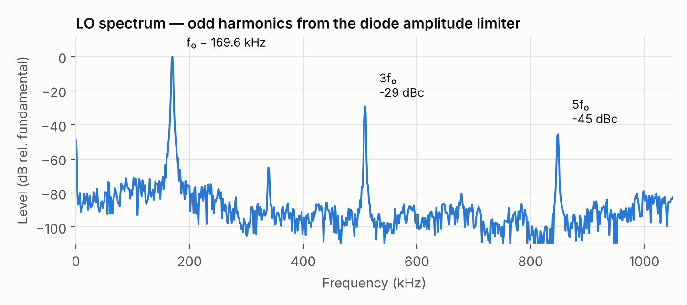

# 2. Quadrature Oscillator

LTspice source: [`simulation/oscillator.asc`](../simulation/oscillator.asc)

## 2.1 Topology

The LO is the **three-RC quadrature oscillator** from TI's op-amp oscillator note (Mancini [1], Fig. 8), built with two UA741s on ±12 V:

| Stage | Components | Transfer function (ideal op-amp) |
|---|---|---|
| **U1** — inverting integrator | R1 = 1.7 kΩ, C3 = 0.1 nF | $-\dfrac{1}{sR_1C_3}$ |
| **U2** — non-inverting integrator | R2 = 736 Ω, C1 = 1 nF (low-pass on +); R3 = 750 Ω, C2 = 1 nF (feedback) | $\dfrac{sR_3C_2 + 1}{sR_3C_2\,(sR_2C_1 + 1)} \;\xrightarrow{R_2C_1=R_3C_2=\tau}\; \dfrac{1}{s\tau}$ |
| **Limiters** | anti-parallel 1N4148 + 100 Ω across C3 and across C2 | amplitude control |

U1 output is the **LO-Q** phase (drives the Q mixer); U2 output is the **LO-I** phase (drives the I mixer).

Why this topology rather than a Wien-bridge or Bubba oscillator:

- it produces two phases directly, with no separate 90° phase shifter;
- it needs only two op-amps;
- the 90° comes from integration, ideally independent of component values.

The trade-off, which TI also points out, is higher distortion than the four-section Bubba oscillator.

## 2.2 Loop analysis

Around the loop, $A\beta = -\dfrac{1}{s^2 R_1C_3\,\tau}$. Setting $A\beta = 1$:

$$
\omega_0 = \frac{1}{\sqrt{R_1C_3\,\tau}}.
$$

TI's design rule makes all three time constants equal, giving $f_0 = 1/(2\pi RC)$ — for 170 kHz that means R ≈ 936 Ω with 1 nF.

**This design deliberately does not.** $R_1C_3 = 0.17$ µs while $\tau \approx 0.74$ µs, so with ideal op-amps the loop would oscillate at

$$
f_0 = \frac{1}{2\pi\sqrt{(0.17\ \mu s)(0.74\ \mu s)}} \approx 448\ \text{kHz}.
$$

At the frequency it actually runs (169.6 kHz), that gives the loop about **7× excess gain**: $(448/169.6)^2 \approx 7.0$.

## 2.3 Why the 741 sets the frequency

From the UA741 macromodel used in simulation (Boyle model, 1989):

| Parameter | From the model | Consequence at 170 kHz |
|---|---|---|
| Gain-bandwidth | $G_A / 2\pi C_2 \approx 1.1$ MHz | open-loop gain only ≈ 5.9–6.5 |
| Slew rate | $I_{EE}/C_2 \approx 0.51$ V/µs | 1 Vpp needs $2\pi f V_p \approx 0.53$ V/µs |
| Full-power bandwidth | $SR / \pi V_{pp} \approx 162$ kHz at 1 Vpp | the oscillator runs just above it |

With so little op-amp gain, the "virtual ground" and "inputs track" assumptions fail. Each op-amp adds significant phase lag, and the loop settles at the frequency where **the op-amps' lag, not the RC network**, completes the −180°. The 7× excess gain designed in is what lets the loop overcome the 741's gain deficit and start reliably.

Hölzel [2] makes the same point for op-amp quadrature oscillators generally: full-power bandwidth, not GBW, is the best predictor of the usable frequency range, and quadrature accuracy depends on the stages being matched.

This also explains the hardware frequency (168.5 kHz vs 169.6 kHz in simulation): a real 741's bandwidth differs from the 1989 macromodel, so the frequency moves with it.

## 2.4 Where the 90° goes

The data shows the mechanism directly. Measured at the U2 inputs in simulation:

| Node | Amplitude | Phase vs. LO-Q |
|---|---|---|
| U2 + input (after R2/C1) | 410 mVpk | −38.2° |
| U2 − input | 303 mVpk | −52.1° |

The two inputs of U2 differ by **14° and 26 %**: the op-amp cannot hold them together at this frequency. As a result, U2 delivers −102.8° instead of the ideal −90°, so

> **LO-I lags LO-Q by 102.8° — a 12.8° quadrature error caused by finite op-amp gain.**

## 2.5 Amplitude control

A linear oscillator with loop gain exactly 1 is not physically achievable: slightly above 1 it grows until it clips; slightly below 1 it dies. Each integrator therefore has a pair of anti-parallel 1N4148 diodes, each with a 100 Ω series resistor, across its capacitor.

- **Small amplitude:** the diodes are off, the loop gain is the full ~7×, and oscillation builds quickly.
- **Large amplitude:** once the voltage across the capacitor approaches the diode knee (~0.5 V), the diodes conduct, shunting the capacitor and compressing the loop gain toward 1.

The amplitude therefore settles at roughly **twice the diode knee**: 1.07 Vpp (U1) and 1.00 Vpp (U2) in simulation, with no trimming needed.

The cost is odd-order distortion. Symmetric clipping produces **3f₀ at −29 dBc** and 5f₀ at −45 dBc, with even harmonics below −64 dBc (THD ≈ 3.4–4 %).

## 2.6 Results

| | Simulation | Hardware |
|---|---|---|
| Frequency | 169.6 kHz | 168.5 kHz |
| Amplitude, LO-I / LO-Q | 1.00 / 1.07 Vpp | 0.98 / 0.95 Vpp |
| I/Q separation | 102.8° | — |
| THD | 3.4–4.0 % | — |
| Supplies | ±12 V | ±12 V |

| Measured outputs | Measured FFT |
|---|---|
|  |  |

## 2.7 Improving it

- **A faster op-amp.** With GBW and full-power bandwidth well above 170 kHz, the frequency returns to $1/2\pi RC$ and the quadrature error collapses. Equal time constants would then be the right design.
- **Trimming τ in U2** can pull the separation back toward 90° even with the 741, at the cost of sensitivity to the specific part.
- **Softer limiting** (a JFET or lamp AGC, as in TI's Wien-bridge examples) trades start-up speed for lower THD.

## References

1. R. Mancini, "Design of op amp sine wave oscillators," *TI Analog Applications Journal*, Aug. 2000 (SLYT164).
2. R. Hölzel, "A simple wide-band sine wave quadrature oscillator," *IEEE Trans. Instrum. Meas.*, vol. 42, no. 3, 1993.
