# 3. NMOS Switching Mixer

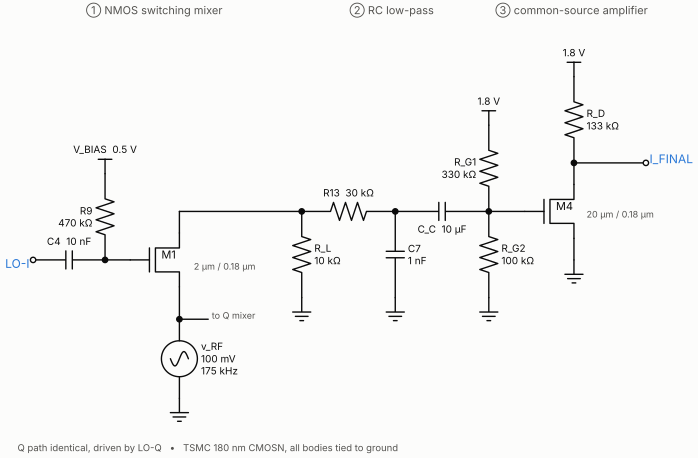

LTspice source: [`simulation/qdc_full_system.asc`](../simulation/qdc_full_system.asc) (M1 for I, M2 for Q)

## 3.1 Circuit

Each path uses a single NMOS as a **passive switching (pass-gate) mixer**:

| Terminal | Connection |
|---|---|
| Gate | LO through CC = 10 nF; DC bias VBIAS = 0.5 V through RBIAS = 470 kΩ |
| Source | RF input, 100 mV at 175 kHz (shared by the I and Q mixers) |
| Drain | IF output across RL = 10 kΩ |
| Body | ground |

The gate network is a high-pass with a corner of $1/(2\pi \cdot 470\,\text{k}\Omega \cdot 10\,\text{nF}) \approx 34$ Hz. That passes the 170 kHz LO untouched while letting VBIAS set the DC level independently of the oscillator.

## 3.2 Switching-mixer theory

The LO swings the gate between cut-off and deep triode. In triode, the channel is a resistor:

$$
R_{ON} = \frac{1}{\mu_n C_{ox}\frac{W}{L}(V_{GS}-V_{TH})}.
$$

Model the switch as multiplying the input by a switching function $s(t)$. For a 50 % square wave,

$$
s(t) = \frac12 + \frac{2}{\pi}\cos\omega_{LO}t - \frac{2}{3\pi}\cos 3\omega_{LO}t + \cdots
$$

Multiplying by $A_1\cos\omega_{in}t$ and keeping the difference term:

$$
v_{IF} = \frac{A_1}{\pi}\cos\omega_{IF}t \quad\Rightarrow\quad G_{conv} = \frac1\pi = -9.9\ \text{dB}.
$$

The $\tfrac12$ term passes RF straight through (RF feedthrough), and the $3\omega_{LO}$ term creates products around 3fLO. A 50 % duty cycle maximises the fundamental coefficient and suppresses even-order switching terms.

**What the circuit actually does.** The LO here is a ~1 Vpp *sine* centred on 0.5 V, so the gate swings roughly 0 to 1.03 V against a threshold of ~0.38 V. The switch is therefore on for roughly 57 % of each cycle and turns on gradually rather than abruptly. The simulated conversion gain is **−10.6 dB (I) / −10.5 dB (Q)**: within 0.7 dB of ideal, with the gap made up of soft switching plus the RON–RL divider.

## 3.3 Device sizing (TSMC 180 nm BSIM3v3)

| Parameter | Value | LTspice |
|---|---|---|
| L / W | 180 nm / 2 µm | `l=180n w=2u` |
| AD, AS | 1.2 µm² | `ad=1.2p as=1.2p` |
| PD, PS | 5.2 µm | `pd=5.2u ps=5.2u` |

AD/AS and PD/PS describe a 0.6 µm source/drain diffusion: $A = W \times 0.6\,\mu$m and $P = 2(W + 0.6\,\mu$m$)$. BSIM uses them to compute junction capacitance.

Key numbers from the model card:

| Model parameter | Value | Meaning |
|---|---|---|
| VTH0 | 0.38 V | zero-bias threshold |
| TOX | 4.1 nm | $C_{ox} \approx 8.4$ fF/µm² |
| U0 | 281 cm²/V·s | $\mu_n C_{ox} \approx 236$ µA/V² (low-field) |
| CJ / CJSW | 0.97 fF/µm² / 0.25 fF/µm | junction capacitance per area / perimeter |

**RON** at the LO peak (VGS ≈ 1 V) works out to about **0.5–0.7 kΩ** and rises steeply as the gate approaches threshold. With RL = 10 kΩ this costs well under 1 dB. With a 1 kΩ load it would cost about 4 dB, which is why the larger load was chosen.

**Parasitics are negligible at this frequency, and the analysis shows why.** The device capacitances are:

- gate oxide: $C_{ox}WL \approx 3$ fF;
- overlap: about 1.4 fF per side;
- junctions: about 2.5 fF each (bottom + sidewall).

At 170 kHz, 5 fF is about 190 MΩ. That is irrelevant next to 10 kΩ, and roughly 1000× smaller than breadboard capacitance. In this design the geometry matters for **RON**, not speed. LO feedthrough on the bench is set by board parasitics and the coupling network, not by the transistor.

## 3.4 Non-idealities seen in the data

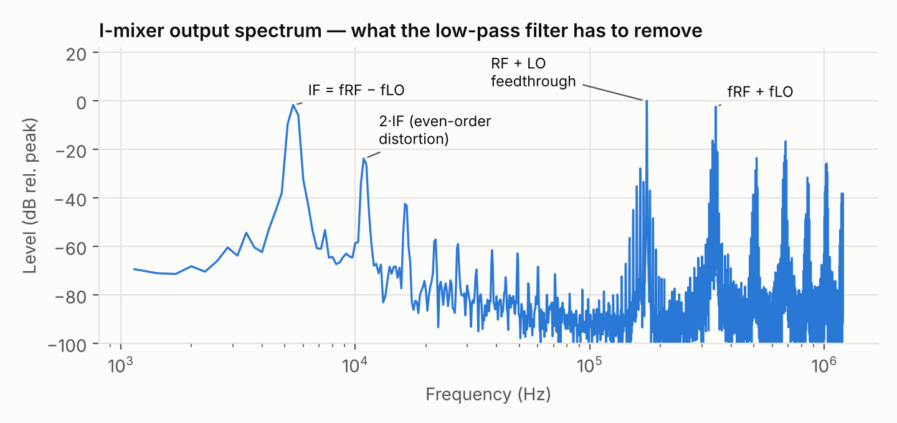

| Product | Level (rel. IF) | Cause |
|---|---|---|
| IF, 5.47 kHz | 0 dB | wanted |
| **2·IF, 10.9 kHz** | **−22 dBc** | RON modulated by the input: the source is driven, so VGS = vLO − vRF; body effect adds to it |
| 3·IF | −40 dBc | odd-order switch nonlinearity |
| ~170–175 kHz | large | LO and RF feedthrough (the ½ term of s(t)) |
| 344.5 kHz | large | sum product fRF + fLO |
| DC | −2.6 mV at filter output | LO self-mixing and feedthrough — blocked by the amplifier's coupling capacitor |

The body effect raises the threshold whenever the source rises above ground:

$$
V_{TH} = V_{TH0} + \gamma\left(\sqrt{2\phi_F + V_{SB}} - \sqrt{2\phi_F}\right).
$$

That adds an input-dependent term to RON — an even-order mechanism. The remedies are:

- a CMOS transmission gate (NMOS ∥ PMOS), which flattens RON across the input swing;
- a double-balanced mixer, which cancels even-order products and LO feedthrough by symmetry.

## 3.5 Frequency sweep

With the LO near 170 kHz and a 100 mV input:

| fin | 165 kHz | 168 kHz | 169 kHz | 171 kHz | 172 kHz | 175 kHz |
|---|---|---|---|---|---|---|
| Expected IF | 5 kHz | 2 kHz | 1 kHz | 1 kHz | 2 kHz | 5 kHz |

The IF appears at the difference frequency in every case. An input below the LO and one above it give the same |IF| — the image ambiguity from [Theory §1.2](01-theory.md#12-the-image-problem-with-a-single-mixer) that the I/Q pair resolves.

| fin | Transient | FFT |
|---|---|---|
| 165 kHz | 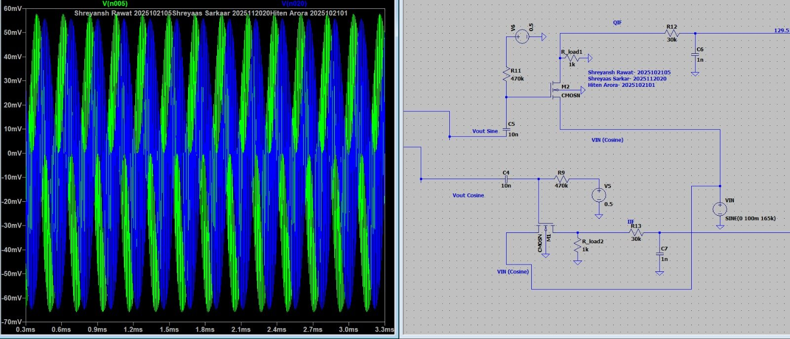 | 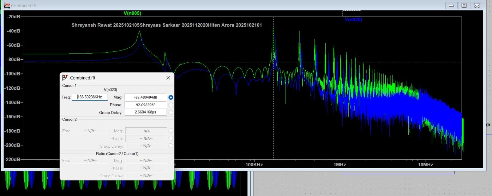 |
| 168 kHz | 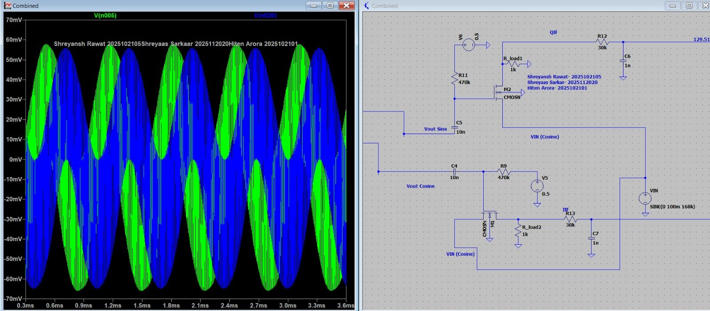 | 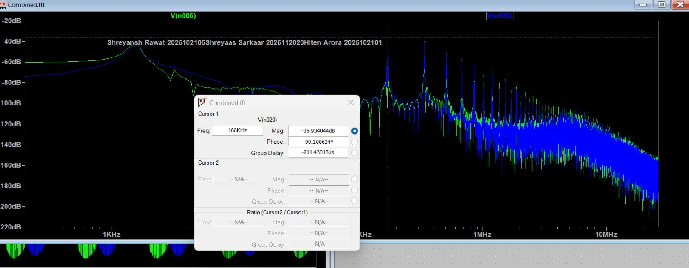 |
| 169 kHz | 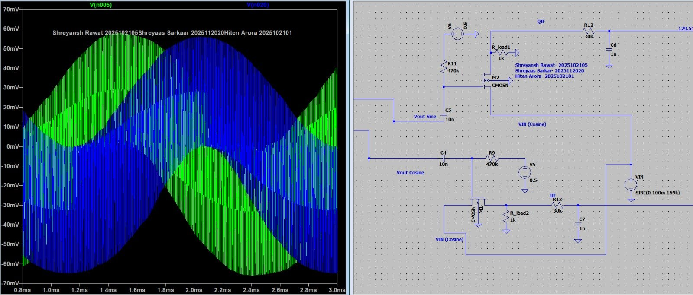 | 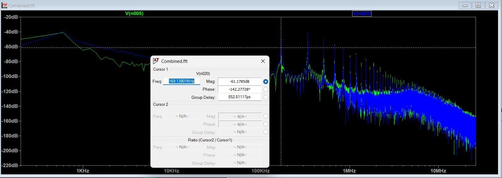 |
| 171 kHz | 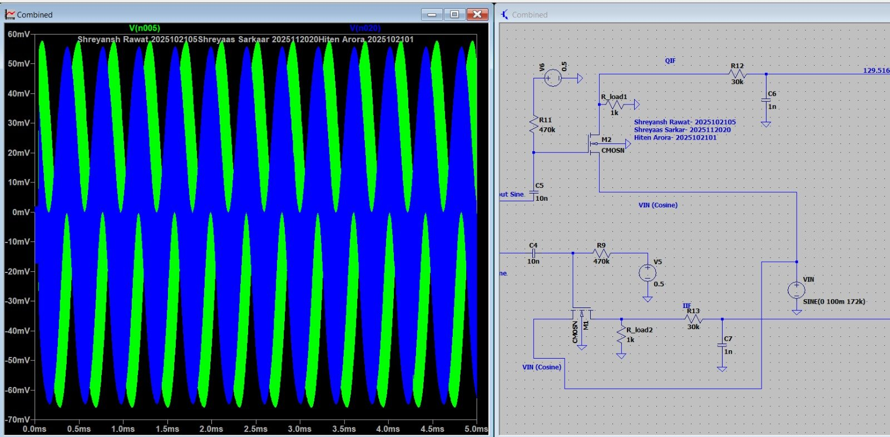 | — |
| 172 kHz | — | 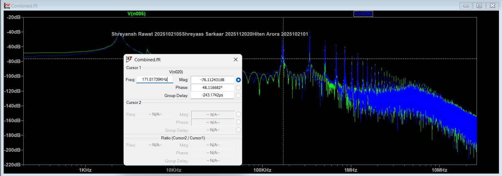 |
| 175 kHz | 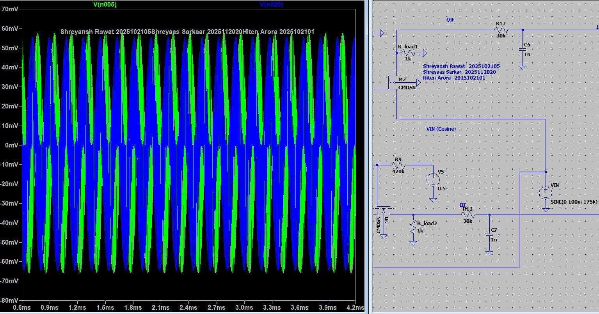 | 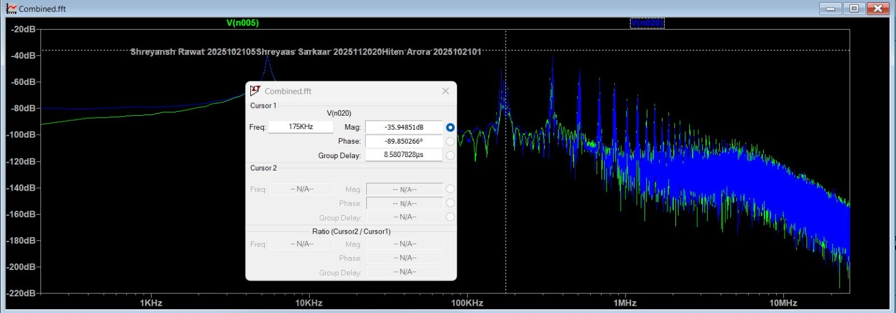 |

## 3.6 Hardware

The bench mixer used a discrete lab NMOS, characterised first with two function generators (LO and RF). Its geometry is fixed, and its RON at the chosen bias was about **0.8–1 kΩ**, so measured conversion gain was **−13 dB**: about 2.4 dB below simulation, with breadboard parasitics contributing as well.

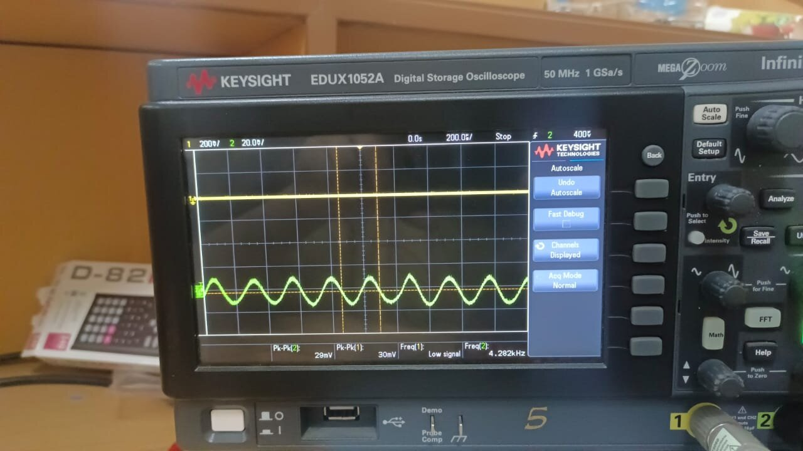

Measured mixer output (fin = 176 kHz).
