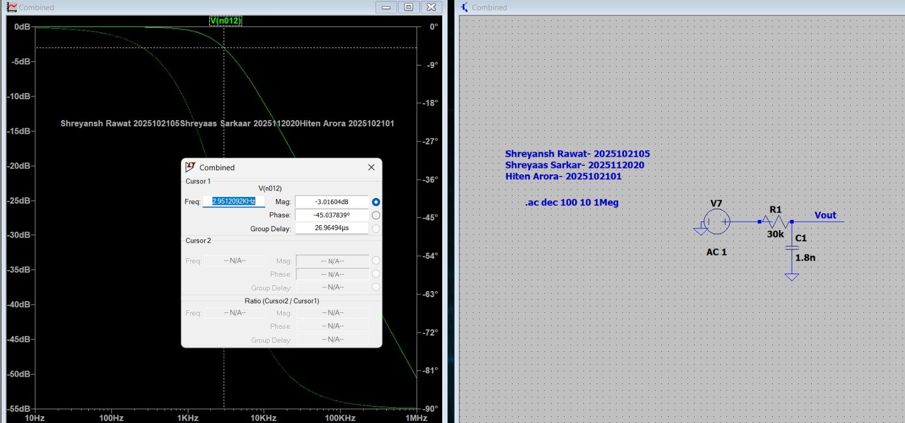
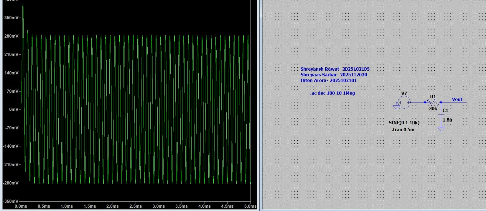

# 4. IF Low-Pass Filter and Output Amplifier

## 4.1 What the filter has to remove

The mixer output (see the [mixer spectrum](../media/plots/mixer_spectrum.png)) carries:

- the wanted IF at 5.47 kHz;
- the 2·IF distortion product at 10.9 kHz;
- RF and LO feedthrough at 170–175 kHz;
- the sum product at 344.5 kHz;
- products around the LO harmonics.

A first-order passive RC low-pass (R13 = 30 kΩ, C7 = 1 nF per path) separates the IF from everything at the LO rate and above.

## 4.2 Choosing the corner

A first-order section has $f_c = 1/(2\pi RC)$. The original target was 3 kHz, which can be met two ways:

| Option | R | C | fc |
|---|---|---|---|
| Fix C | 53 kΩ (51/56 kΩ standard) | 1 nF | ≈ 3.0 kHz |
| Fix R | 30 kΩ | 1.8 nF | 2.95 kHz |

**Design decision.** The system IF is about 5.5 kHz, so a 3 kHz corner would put the wanted signal on the filter's skirt. The integrated design uses **30 kΩ / 1 nF → fc ≈ 5.3 kHz**. That keeps the IF near the passband while still giving about 30 dB at the LO and 36 dB at the sum product:

| Frequency | Content | Ideal first-order attenuation |
|---|---|---|
| 5.47 kHz | IF | −3.1 dB, −46° |
| 170 kHz | LO feedthrough | −30 dB |
| 344.5 kHz | sum product | −36 dB |

The stand-alone filter was characterised with an AC sweep and with transient tests below and above the corner:

| AC response | 10 kHz transient |
|---|---|
|  |  |

## 4.3 Loading: why the IF loses 4.8 dB, not 3 dB

In the full system the filter does not see an ideal source:

- The drive comes from the mixer drain, which sits across the 10 kΩ load and a switch whose resistance changes every LO cycle.
- The filter output feeds the amplifier's 330 kΩ ∥ 100 kΩ bias network (76.7 kΩ) through the coupling capacitor.

The measured IF transfer from mixer drain to filter output is **−4.8 dB with −36.6° phase**, the same within 0.1° in both I and Q. Because the I and Q filters are identical, the filter adds **no** quadrature error. Only component mismatch between the two filters would.

## 4.4 Common-source amplifier

The filtered IF (~34 mVpp) is amplified by a single NMOS common-source stage on 1.8 V. Op-amps are reserved for the oscillator, so all signal gain is discrete.

| Parameter | Value |
|---|---|
| Device | TSMC 180 nm NMOS, W/L = 20 µm / 0.18 µm |
| Gate bias | RG1 = 330 kΩ to 1.8 V, RG2 = 100 kΩ to ground → VG = 0.419 V |
| Drain load | RD = 133 kΩ |
| Operating point (simulated) | ID = 5.4 µA, VD = 1.09 V |
| Input coupling | CC = 10 µF → high-pass corner $1/(2\pi \cdot 76.7\,\text{k}\Omega \cdot 10\,\mu\text{F}) \approx 0.2$ Hz |
| Measured gain | **11.9 V/V (+21.5 dB)** |
| Power | ≈ 17 µW per stage (device + bias divider) |

**Operating region.** With VGS = 0.42 V against VTH0 = 0.38 V, the device sits at the edge of weak inversion. There, $g_m/I_D$ is near its maximum, which is how a 5 µA stage reaches a gain of 12.

- A weak-inversion estimate, $g_m \approx I_D / nV_T \approx 150$ µS, gives $g_mR_D \approx 20$ as an upper bound.
- The realised 11.9 reflects the device's finite output resistance and its moderate (rather than deep weak) inversion.

Two consequences follow:

- **Bias sensitivity.** Gain depends steeply on VGS − VTH. A few tens of mV of threshold variation between parts changes the gain noticeably, which matters when moving to hardware.
- **Distortion.** The exponential/square-law transfer adds second harmonic. The output shows 2·IF at −20 dBc, against −22 dBc at the mixer.

Output: **405 mVpp (I) and 411 mVpp (Q)** against a 400 mVpp target.

## 4.5 Improving it

- A second-order section (two RC poles, or a Sallen-Key with a unity-gain buffer) gives −40 dB/decade and removes the LO ripple visible on the outputs.
- Biasing the CS stage with a source-degeneration resistor (bypassed at the IF) would trade some gain for much better bias stability and linearity.
