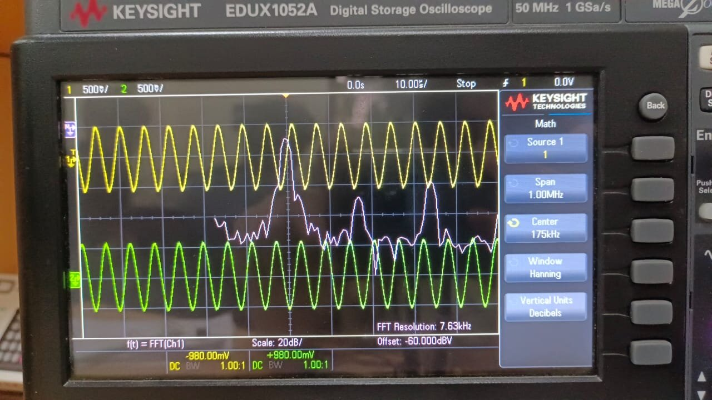

# Hardware Prototype

The complete receiver was built on solderless breadboard from discrete, off-the-shelf parts and characterised with standard bench instruments.

## Bill of materials (I + Q system)

| Qty | Part | Value / type | Role |
|---|---|---|---|
| 2 | Op-amp | UA741 | Quadrature oscillator (U1, U2) |
| 4 | Diode | 1N4148 | Oscillator amplitude limiters |
| 4 | Resistor | 100 Ω | In series with each limiter diode |
| 1 | Resistor | 1.7 kΩ | U1 integrator input (R1) |
| 1 | Capacitor | 0.1 nF | U1 integrator (C3) |
| 2 | Resistor | 750 Ω | U2 time constants (R2, R3) |
| 2 | Capacitor | 1 nF | U2 time constants (C1, C2) |
| 2 | NMOS | discrete lab NMOS <!-- add part number --> | Mixers |
| 2 | Capacitor | 10 nF | Mixer gate coupling |
| 2 | Resistor | 470 kΩ | Mixer gate bias |
| 2 | Resistor | 10 kΩ | Mixer load |
| 2 | Resistor | 30 kΩ | IF low-pass |
| 2 | Capacitor | 1 nF | IF low-pass |
| 2 | NMOS | discrete lab NMOS | CS amplifiers |
| 2 | Capacitor | 10 µF | Amplifier input coupling |
| 2 + 2 + 2 | Resistors | gate divider + drain load | CS amplifier bias (see [schematic](../media/schematics/signal_path.svg)) |

## Bench setup

| Instrument | Role |
|---|---|
| Keysight InfiniiVision EDUX1052A oscilloscope | Time-domain waveforms, I/Q phase, built-in FFT |
| Function generator 1 | RF input: 100 mV, tuned around 173–176 kHz |
| Function generator 2 | LO drive, for stand-alone mixer characterisation |
| Dual DC power supply | ±12 V for the op-amps; 1.8 V for the MOSFET stages; 0.5 V mixer bias |

## Bring-up sequence

1. **Oscillator first, on its own.** Confirm both outputs, frequency and amplitude before connecting anything else. The diode limiters make start-up reliable and set the ~1 Vpp amplitude without trimming.
2. **Mixers with two generators.** Characterise each mixer with a generator standing in for the LO. This isolates mixer problems from oscillator problems, and is where the lab NMOS's higher RON (~0.8–1 kΩ) showed up as −13 dB conversion gain.
3. **Close the system.** Connect the oscillator to the mixers, then the filters and amplifiers, checking each node on the scope.
4. **Retune the RF, not the LO.** The oscillator settled at 168.5 kHz, so the RF generator was moved to 173.5 kHz to hold the IF at 5.0 kHz. The LO frequency is set by the 741's bandwidth (see [docs/02](../docs/02-quadrature-oscillator.md)) and is not worth fighting.

## Measured results

| Parameter | Value |
|---|---|
| LO frequency | 168.5 kHz |
| LO amplitude, I / Q | 0.98 / 0.95 Vpp |
| Mixer conversion gain | −13 dB |
| IF frequency | 5.0 kHz |
| Final output, I / Q | 385 / 378 mVpp |
| Final I/Q separation | 86° |

| Oscillator outputs | Oscillator FFT | Mixer output (fin = 176 kHz) |
|---|---|---|
|  |  |  |
